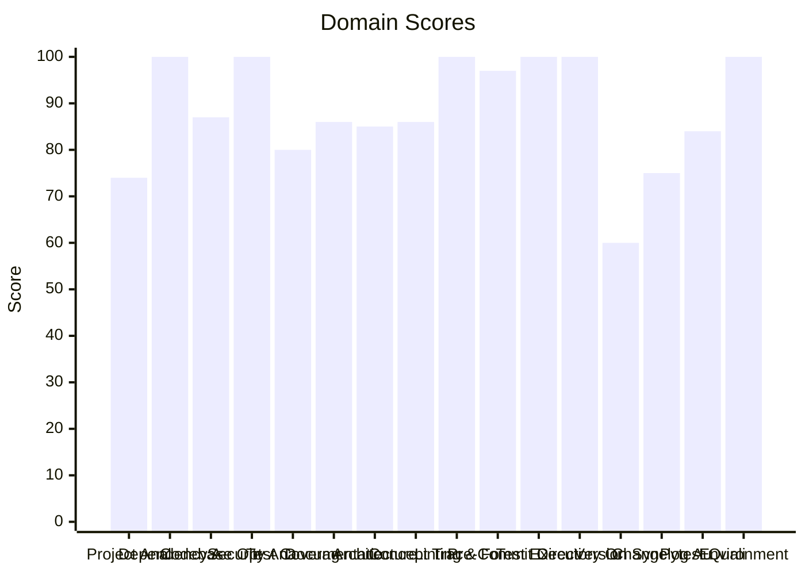

# 🔬 Code Enhancement Report

> **Generated**: 2026-05-25 22:13:48 UTC | **Target**: legal-peripherals-mcp | **Overall GPA**: 3.19/4.0

---

## 📊 Executive Summary

| Domain | Grade | Score | Status |
|--------|-------|-------|--------|
| Version Sync Analysis | 🟠 D | 60/100 | `████████████░░░░░░░░` 60/100 |
| Project Analysis | 🟡 C | 74/100 | `██████████████░░░░░░` 74/100 |
| Changelog Audit | 🟡 C | 75/100 | `███████████████░░░░░` 75/100 |
| Test Coverage | 🔵 B | 80/100 | `████████████████░░░░` 80/100 |
| Pytest Quality | 🔵 B | 84/100 | `████████████████░░░░` 84/100 |
| Architecture & Design Patterns | 🔵 B | 85/100 | `█████████████████░░░` 85/100 |
| Documentation & Governance | 🔵 B | 86/100 | `█████████████████░░░` 86/100 |
| Concept Traceability | 🔵 B | 86/100 | `█████████████████░░░` 86/100 |
| Codebase Optimization | 🔵 B | 87/100 | `█████████████████░░░` 87/100 |
| Pre-Commit Compliance | 🟢 A | 97/100 | `███████████████████░` 97/100 |
| Dependency Audit | 🟢 A | 100/100 | `████████████████████` 100/100 |
| Security Analysis | 🟢 A | 100/100 | `████████████████████` 100/100 |
| Linting & Formatting | 🟢 A | 100/100 | `████████████████████` 100/100 |
| Test Execution | 🟢 A | 100/100 | `████████████████████` 100/100 |
| Directory Organization | 🟢 A | 100/100 | `████████████████████` 100/100 |
| Environment Variables | 🟢 A | 100/100 | `████████████████████` 100/100 |

---

## 📋 Domain Scorecards

### Project Analysis — 🟡 Grade: C (74/100)

`██████████████░░░░░░` 74/100

> [!NOTE]
> Detected ecosystem marker: agent-utilities → Agent-Utilities Ecosystem

| Criterion | Points | Evidence | Reasoning |
|-----------|--------|----------|-----------|
| has_pyproject | 10 | `pyproject.toml and requirements.txt` | Both pyproject.toml and requirements.txt exist, fulfilling mandatory Python proj |
| project_type_detected | 10 | `Agent-Utilities Ecosystem` | Identified 1 ecosystem marker(s) in dependencies |
| externalized_prompts | 0 | `/home/apps/workspace/agent-packages/agents/legal-peripherals` | No prompts/ directory found. Prompts may be hardcoded in source. |
| observability | 0 | `dependency list` | No observability tools (logfire, sentry, opentelemetry) found |
| testing_suite | 10 | `tests dir: True, pytest dep: True` | Tests directory exists, pytest in dependencies |
| agents_md | 10 | `/home/apps/workspace/agent-packages/agents/legal-peripherals` | AGENTS.md exists with comprehensive content |
| pre_commit_hooks | 10 | `/home/apps/workspace/agent-packages/agents/legal-peripherals` | Pre-commit configuration found for automated code quality checks |
| gitignore | 10 | `/home/apps/workspace/agent-packages/agents/legal-peripherals` | .gitignore exists to prevent committing build artifacts and secrets |
| env_template | 10 | `/home/apps/workspace/agent-packages/agents/legal-peripherals` | Environment template exists for onboarding and secret management |
| protocol_support | 4 | `MCP` | 1 communication protocol(s) detected |

**Findings:**
- Protocol support: MCP

---

### Dependency Audit — 🟢 Grade: A (100/100)

`████████████████████` 100/100

| Criterion | Points | Evidence | Reasoning |
|-----------|--------|----------|-----------|
| dependency_freshness | 100 | `source=/home/apps/workspace/agent-packages/agents/legal-peri` | Audited 6 deps (6 installed, 0 constraint-only). 0 major, 0 minor, 0 patch updat |

---

### Codebase Optimization — 🔵 Grade: B (87/100)

`█████████████████░░░` 87/100

| Criterion | Points | Evidence | Reasoning |
|-----------|--------|----------|-----------|
| code_quality | 87 | `{"file_count": 19, "total_lines": 1014, "function_count": 41` | Analyzed 19 files, 41 functions. Avg CC=3.7, max length=108, duplication=0.0%, 0 |

---

### Security Analysis — 🟢 Grade: A (100/100)

`████████████████████` 100/100

| Criterion | Points | Evidence | Reasoning |
|-----------|--------|----------|-----------|
| security_posture | 100 | `high=0 med=0 low=0 attack_surface={"subprocess_calls": 0, "f` | Scanned 19 files. Found 0 security findings. High: -0pts, Med: -0pts, Low: -0pts |

---

### Test Coverage — 🔵 Grade: B (80/100)

`████████████████░░░░` 80/100

> [!NOTE]
> Test suite lacks intent diversity (only one type)

| Criterion | Points | Evidence | Reasoning |
|-----------|--------|----------|-----------|
| test_coverage_quality | 80 | `{"test_file_count": 8, "test_count": 21, "source_file_count"` | 21 tests across 8 files. Ratio: 1.11. Intent: {'unit': 21}. 0 without assertions |

**Findings:**
- 6 potential doc-test drift items

---

### Documentation & Governance — 🔵 Grade: B (86/100)

`█████████████████░░░` 86/100

> [!NOTE]
> README.md missing sections: overview, usage|quick start

| Criterion | Points | Evidence | Reasoning |
|-----------|--------|----------|-----------|
| documentation_quality | 86 | `{"README.md": {"exists": true, "missing": ["overview", "usag` | Audited 6 standard docs + docs/ directory. 1 broken references, 5 docs present.  |

**Findings:**
- README.md is short (129 lines) — consider expanding
- README missing: Has a Table of Contents
- README missing: Has usage examples with code blocks
- README missing: References /docs directory material

---

### Architecture & Design Patterns — 🔵 Grade: B (85/100)

`█████████████████░░░` 85/100

> [!NOTE]
> No discernible layer architecture (no domain/service/adapter separation)

| Criterion | Points | Evidence | Reasoning |
|-----------|--------|----------|-----------|
| architecture_quality | 85 | `{"layers": 0, "di_ratio": 0.0, "solid_violations": 0}` | Analyzed 19 files. 0/5 architecture layers present, DI ratio: 0%, 0 SOLID violat |

---

### Concept Traceability — 🔵 Grade: B (86/100)

`█████████████████░░░` 86/100

| Criterion | Points | Evidence | Reasoning |
|-----------|--------|----------|-----------|
| concept_traceability | 86 | `{"total_concepts": 5, "well_traced": 3, "orphans": 2, "drift` | 5 unique concepts found. 3 fully traced (code+docs+tests), 2 orphans, 0 drifted. |

---

### Linting & Formatting — 🟢 Grade: A (100/100)

`████████████████████` 100/100

> [!TIP]
> Total lint findings: 0 (high/error: 0, medium/warning: 0, low: 0)

| Criterion | Points | Evidence | Reasoning |
|-----------|--------|----------|-----------|
| lint_compliance | 100 | `ruff=0, bandit=0, mypy=0` | 0 total findings across 3 tools. High/error: -0pts, Med/warning: -0pts, Low: -0p |

---

### Pre-Commit Compliance — 🟢 Grade: A (97/100)

`███████████████████░` 97/100

> [!TIP]
> 1 hook(s) may be outdated: ruff-pre-commit

| Criterion | Points | Evidence | Reasoning |
|-----------|--------|----------|-----------|
| precommit_compliance | 97 | `{"total_hooks": 2, "passed": 0, "failed": 0, "skipped": 0, "` | Ran pre-commit with 2 hooks: 0 passed, 0 failed, 0 skipped. 1 potentially outdat |

---

### Test Execution — 🟢 Grade: A (100/100)

`████████████████████` 100/100

| Criterion | Points | Evidence | Reasoning |
|-----------|--------|----------|-----------|
| test_execution | 100 | `{"frameworks_detected": 1, "total_passed": 21, "total_failed` | Executed 1 framework(s). 21 passed, 0 failed, 0 errors. Pass rate: 100%. |

---

### Directory Organization — 🟢 Grade: A (100/100)

`████████████████████` 100/100

| Criterion | Points | Evidence | Reasoning |
|-----------|--------|----------|-----------|
| directory_organization | 100 | `{"total_source_files": 35, "total_directories": 9, "max_dept` | 35 files across 9 directories. Max depth: 3, avg files/dir: 3.9. 0 crowded, 0 se |

---

### Version Sync Analysis — 🟠 Grade: D (60/100)

`████████████░░░░░░░░` 60/100

> [!WARNING]
> Found 2 file(s) with version '0.15.0' that are NOT tracked in .bumpversion.cfg:

| Criterion | Points | Evidence | Reasoning |
|-----------|--------|----------|-----------|
| bumpversion_exists | 20 | `/home/apps/workspace/agent-packages/agents/legal-peripherals` | .bumpversion.cfg found |
| current_version_defined | 20 | `0.15.0` | Current version tracked is 0.15.0 |
| files_tracked | 20 | `1 files tracked` | Found 1 files tracked in .bumpversion.cfg |
| version_drift_check | 0 | `2 untracked files` | Version definitions found in codebase that are missing from .bumpversion.cfg |

**Findings:**
-   - .specify/results.json
-   - .specify/reports/code_enhancement_report.md

---

### Changelog Audit — 🟡 Grade: C (75/100)

`███████████████░░░░░` 75/100

> [!NOTE]
> CHANGELOG.md exists but could not be parsed — check format compliance

| Criterion | Points | Evidence | Reasoning |
|-----------|--------|----------|-----------|
| changelog_quality | 75 | `{"exists": true, "parseable": false, "version_count": 0, "ha` | CHANGELOG.md exists. 0 versions tracked. 0 dependency changelogs analyzed. |

**Findings:**
- No changelog entries within the last 30 days
- keepachangelog not installed — pip install 'universal-skills[code-enhancer]'

---

### Pytest Quality — 🔵 Grade: B (84/100)

`████████████████░░░░` 84/100

> [!NOTE]
> Test directory lacks subdirectory organization (consider unit/, integration/, e2e/)

| Criterion | Points | Evidence | Reasoning |
|-----------|--------|----------|-----------|
| pytest_quality | 84 | `{"test_files": 8, "total_tests": 21, "descriptive_name_ratio` | 21 tests across 8 files. Naming: 20/20, Structure: 17/20, Fixtures: 7/20, Assert |

**Findings:**
- Low fixture usage: only 10% of tests use fixtures
- No @pytest.mark.parametrize usage — consider data-driven tests

---

### Environment Variables — 🟢 Grade: A (100/100)

`████████████████████` 100/100

| Criterion | Points | Evidence | Reasoning |
|-----------|--------|----------|-----------|
| env_var_documentation | 100 | `{"total_vars": 7, "python_vars": 7, "dockerfile_vars": 0, "c` | Found 7 unique env vars across 18 occurrences. README documents 7/7. Has .env.ex |

---

## 🎯 Prioritized Action Items

| # | Priority | Domain | Action | Impact | Risk |
|---|----------|--------|--------|--------|------|
| 1 | 🔴 High | Version Sync Analysis | Found 2 file(s) with version '0.15.0' that are NOT tracked in .bumpversion.cfg: | High | Medium |
| 2 | 🔴 High | Version Sync Analysis |   - .specify/results.json | High | Medium |
| 3 | 🔴 High | Version Sync Analysis |   - .specify/reports/code_enhancement_report.md | High | Medium |
| 4 | 🟡 Medium | Project Analysis | Detected ecosystem marker: agent-utilities → Agent-Utilities Ecosystem | Medium | Low |
| 5 | 🟡 Medium | Project Analysis | Protocol support: MCP | Medium | Low |
| 6 | 🟡 Medium | Changelog Audit | CHANGELOG.md exists but could not be parsed — check format compliance | Medium | Low |
| 7 | 🟡 Medium | Changelog Audit | No changelog entries within the last 30 days | Medium | Low |
| 8 | 🟡 Medium | Changelog Audit | keepachangelog not installed — pip install 'universal-skills[code-enhancer]' | Medium | Low |
| 9 | 🟢 Low | Test Coverage | Test suite lacks intent diversity (only one type) | Low | Low |
| 10 | 🟢 Low | Test Coverage | 6 potential doc-test drift items | Low | Low |
| 11 | 🟢 Low | Documentation & Governance | README.md missing sections: overview, usage|quick start | Low | Low |
| 12 | 🟢 Low | Documentation & Governance | README.md is short (129 lines) — consider expanding | Low | Low |
| 13 | 🟢 Low | Documentation & Governance | README missing: Has a Table of Contents | Low | Low |
| 14 | 🟢 Low | Documentation & Governance | README missing: Has usage examples with code blocks | Low | Low |
| 15 | 🟢 Low | Documentation & Governance | README missing: References /docs directory material | Low | Low |
| 16 | 🟢 Low | Architecture & Design Patterns | No discernible layer architecture (no domain/service/adapter separation) | Low | Low |
| 17 | 🟢 Low | Pytest Quality | Test directory lacks subdirectory organization (consider unit/, integration/, e2 | Low | Low |
| 18 | 🟢 Low | Pytest Quality | Low fixture usage: only 10% of tests use fixtures | Low | Low |
| 19 | 🟢 Low | Pytest Quality | No @pytest.mark.parametrize usage — consider data-driven tests | Low | Low |
| 20 | 🟢 Low | Linting & Formatting | Total lint findings: 0 (high/error: 0, medium/warning: 0, low: 0) | Low | Low |
| 21 | 🟢 Low | Pre-Commit Compliance | 1 hook(s) may be outdated: ruff-pre-commit | Low | Low |

---

## 🔄 SDD Handoff

Run `generate_sdd_handoff.py` with this report's JSON data to produce
structured TODO items compatible with the `spec-generator` → `task-planner` →
`sdd-implementer` pipeline. Output will be saved to `.specify/specs/`.
