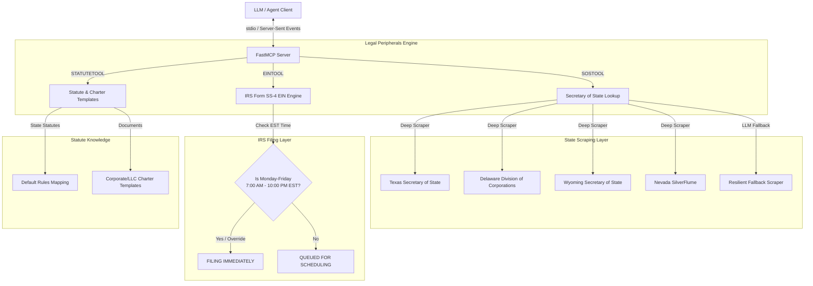

# ⚖️ Legal Peripherals MCP Server

<p align="center">
  
  
  
</p>

A premium Model Context Protocol (MCP) server powered by **FastMCP** that exposes highly robust tools for automating legal operations and filing compliance. This server handles state-level Secretary of State (SOS) entities, off-hours compliant IRS Form SS-4 EIN drafting/scheduling, and corporate/LLC charter templates lookup.

> **Documentation** — Installation, deployment, usage across the API and MCP
> interfaces, and the optional agent server are maintained in the
> [official documentation](https://knuckles-team.github.io/legal-peripherals-mcp/).

---

## 🗺️ System Architecture

The following diagram illustrates how the `Legal Peripherals MCP Server` coordinates between external LLM clients, state Secretary of State (SOS) databases, the IRS Form SS-4 preparation engine, and local template resources:



---

## 🛠️ MCP Tools Mapping

The server registers the following standard FastMCP tools, which can be dynamically enabled or disabled via environment toggles:

| Tool Name | Parameters | Returns | Description |
| :--- | :--- | :--- | :--- |
| `sos_entity_lookup` | `state` (str), `entity_name` (str), `entity_id` (str, optional) | `str` (JSON/text result) | Performs Secretary of State entity lookups across all 50 states (utilizes optimized scrapers for TX, DE, WY, NV and fallbacks for others). |
| `draft_ein_form` | `legal_name` (str), `responsible_party_ssn` (str), `responsible_party_name` (str), `business_type` (str), etc. | `str` (drafted form & queue details) | Drafts IRS Form SS-4 and schedules filing with strict off-hours compliance (Mon-Fri 7:00 AM - 10:00 PM EST). Supports developer bypass override. |
| `lookup_statute_rules` | `state` (str), `entity_type` (str), `topic` (str) | `str` (statute details & templates) | Queries state statutory default rules (director voting, indemnification, etc.) and retrieves template charter links. |

---

## ⚙️ Environment Variables

Configure the server runtime using a `.env` file or direct container environment injections:

| Environment Variable | Type | Default | Description |
| :--- | :--- | :--- | :--- |
| **`SOSTOOL`** | `bool` | `True` | Toggle the `sos_entity_lookup` tool. |
| **`EINTOOL`** | `bool` | `True` | Toggle the `draft_ein_form` tool. |
| **`STATUTETOOL`** | `bool` | `True` | Toggle the `lookup_statute_rules` tool. |
| **`BYPASS_IRS_FILING_HOURS`** | `bool` | `False` | Bypasses the active-hours restriction during development/testing, enabling immediate submission mockups at any hour. |
| **`LEGAL_PERIPHERALS_BASE_URL`** | `str` | `http://localhost:8000` | The base URL of the backing legal peripherals web platform API. |
| **`LEGAL_PERIPHERALS_TOKEN`** | `str` | `""` | The authentication token / bearer credential for the backing API. |
| **`LEGAL_PERIPHERALS_SSL_VERIFY`** | `bool` | `True` | Toggles whether SSL verification is enforced on backing requests. |

---

## 🚀 Deployment & Installation

### Option 1: Bare-Metal Setup (pip)

1. **Clone the Repository & Install Dependencies**:
   ```bash
   pip install -r requirements.txt
   ```

2. **Configure your Environment**:
   Create a `.env` file from the template:
   ```bash
   cp .env.example .env
   ```

3. **Start the Server**:
   ```bash
   python -m legal_peripherals_mcp.mcp_server
   ```

---

### Option 2: Containerized Setup (Docker)

To run the Legal Peripherals MCP Server as a headless background container or expose it via an orchestrator (like Portainer):

1. **Build the Docker Image**:
   ```bash
   docker build -t legal-peripherals-mcp .
   ```

2. **Run the Container**:
   Pass your configuration variables as environment flags:
   ```bash
   docker run -d \
     --name legal-peripherals-mcp-service \
     -e SOSTOOL=True \
     -e EINTOOL=True \
     -e STATUTETOOL=True \
     -e BYPASS_IRS_FILING_HOURS=True \
     legal-peripherals-mcp
   ```

---

## 🧪 Running the Test Suite

We maintain 100% logic coverage using `pytest` to verify off-hours filing computations, bypass states, Secretary of State scrapers, and charter mappings:

```bash
# Run tests with detailed verbose output
pytest -v
```

---

## Documentation

The complete documentation is published as the
[official documentation site](https://knuckles-team.github.io/legal-peripherals-mcp/)
and is the recommended reference for installation, deployment, and day-to-day
operation.

| Page | Contents |
|---|---|
| [Installation](https://knuckles-team.github.io/legal-peripherals-mcp/installation/) | pip, source, extras, prebuilt Docker image |
| [Deployment](https://knuckles-team.github.io/legal-peripherals-mcp/deployment/) | run the MCP server, the agent server, Compose, Caddy + Technitium, env config |
| [Usage](https://knuckles-team.github.io/legal-peripherals-mcp/usage/) | the MCP tools, the `Api` client, example prompts |
| [Overview](https://knuckles-team.github.io/legal-peripherals-mcp/overview/) | the three core domains and how they fit together |
| [Concepts](https://knuckles-team.github.io/legal-peripherals-mcp/concepts/) | concept registry (`CONCEPT:LEGAL-*`) |

`AGENTS.md` is the canonical contributor/agent guidance.

<!-- BEGIN GENERATED: additional-deployment-options -->
### Additional Deployment Options

`legal-peripherals-mcp` can also run as a **local container** (Docker / Podman / `uv`) or be
consumed from a **remote deployment**. The
[Deployment guide](https://knuckles-team.github.io/legal-peripherals-mcp/deployment/) has full, copy-paste
`mcp_config.json` for all four transports — **stdio**, **streamable-http**,
**local container / uv**, and **remote URL**:

- **Local container / uv** — launch the server from `mcp_config.json` via `uvx`,
  `docker run`, or `podman run`, or point at a local streamable-http container by `url`.
- **Remote URL** — connect to a server deployed behind Caddy at
  `http://legal-peripherals-mcp.arpa/mcp` using the `"url"` key.
<!-- END GENERATED: additional-deployment-options -->


<!-- BEGIN agent-os-genesis-deploy (generated; do not edit between markers) -->

## Deploy with `agent-os-genesis`

This package can be provisioned for you — skill-guided — by the **`agent-os-genesis`**
universal skill (its *single-package deploy mode*): it picks your install method, seeds
secrets to OpenBao/Vault (or `.env`), trusts your enterprise CA, registers the MCP
server, and verifies it — the same machinery that stands up the whole Agent OS, narrowed
to just this package. Ask your agent to **"deploy `legal-peripherals-mcp` with agent-os-genesis"**.

| Install mode | Command |
|------|---------|
| Bare-metal, prod (PyPI) | `uvx legal-peripherals-mcp` · or `uv tool install legal-peripherals-mcp` |
| Bare-metal, dev (editable) | `uv pip install -e ".[all]"` · or `pip install -e ".[all]"` |
| Container, prod | deploy `knucklessg1/legal-peripherals-mcp:latest` via docker-compose / swarm / podman / podman-compose / kubernetes |
| Container, dev (editable) | deploy `docker/compose.dev.yml` (source-mounted at `/src`; edits live on restart) |

Secrets are read-existing + seeded via `vault_sync` — you are only prompted for what's missing.

<!-- END agent-os-genesis-deploy -->
