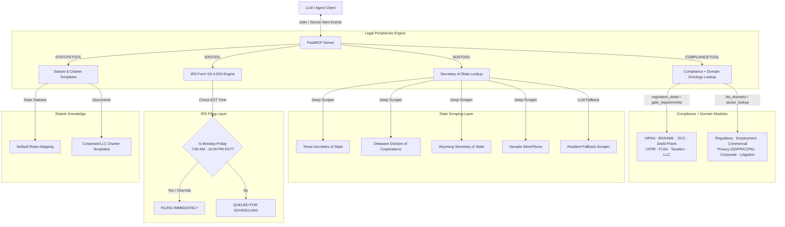

# ⚖️ Legal Peripherals MCP Server

<p align="center">
  
  
  
</p>

A premium Model Context Protocol (MCP) server powered by **FastMCP** that exposes highly robust tools for automating legal operations and filing compliance. This server handles state-level Secretary of State (SOS) entities, off-hours compliant IRS Form SS-4 EIN drafting/scheduling, and corporate/LLC charter templates lookup.

> **Documentation** — Installation, deployment, usage across the API and MCP
> interfaces, and the optional agent server are maintained in the
> [official documentation](https://knuckles-team.github.io/legal-peripherals-mcp/).

---

## 🗺️ System Architecture

The following diagram illustrates how the `Legal Peripherals MCP Server` coordinates between external LLM clients, state Secretary of State (SOS) databases, the IRS Form SS-4 preparation engine, and local template resources:



---

## 🛠️ MCP Tools Mapping

The server registers the following standard FastMCP tools, which can be dynamically enabled or disabled via environment toggles:

Auto-generated — do not edit between the markers below.

<!-- MCP-TOOLS-TABLE:START -->

#### Condensed action-routed tools (default — `MCP_TOOL_MODE=condensed`)

| MCP Tool | Toggle Env Var | Description |
|----------|----------------|-------------|
| `draft_ein_form` | `EINTOOL` | Draft IRS Form SS-4 and schedule EIN filing with off-hours compliance (Mon-Fri 7:00 AM - 10:00 PM EST). |
| `legal_compliance_lookup` | `COMPLIANCETOOL` | Query the bundled compliance + domain ontology suite (KG-native, no external API). |
| `lookup_statute_rules` | `STATUTETOOL` | Query state statutory default rules and retrieve corporate/LLC charter templates. |
| `sos_entity_lookup` | `SOSTOOL` | Perform Secretary of State entity lookup across 50 states (scrapers for TX, DE, WY, NV, resilient fallback for others). |

#### Verbose 1:1 API-mapped tools (`MCP_TOOL_MODE=verbose` or `both`)

<details>
<summary>1 per-operation tools — one per public API method (click to expand)</summary>

| MCP Tool | Toggle Env Var | Description |
|----------|----------------|-------------|
| `legal_peripherals_request` | `APITOOL` | Invoke the request operation. |

</details>

_4 action-routed tool(s) (default) · 1 verbose 1:1 tool(s). Each is enabled unless its `<DOMAIN>TOOL` toggle is set false; `MCP_TOOL_MODE` selects the surface (`condensed` default · `verbose` 1:1 · `both`). Auto-generated — do not edit._
<!-- MCP-TOOLS-TABLE:END -->

---

### MCP Configuration Examples

<!-- MCP-CONFIG-EXAMPLES:START -->

> **Install the connector-focused `[mcp]` extra.** Examples use `legal-peripherals-mcp[mcp]` to add
> FastMCP / FastAPI through `agent-utilities[mcp]`; the required Agent Utilities core
> still carries `epistemic-graph[full]`. The `[agent-runtime]` extra additionally
> enables model orchestration.

#### stdio Transport (local IDEs — Cursor, Claude Desktop, VS Code)

```json
{
  "mcpServers": {
    "legal-peripherals-mcp": {
      "command": "uvx",
      "args": [
        "--from",
        "legal-peripherals-mcp[mcp]",
        "legal-peripherals-mcp"
      ],
      "env": {
        "MCP_TOOL_MODE": "intent",
        "BYPASS_IRS_FILING_HOURS": "False",
        "COMPLIANCETOOL": "True",
        "EINTOOL": "True",
        "EIN_TIMEOUT_SECONDS": "30",
        "LEGAL_PERIPHERALS_BASE_URL": "http://localhost:8000",
        "OPENCORPORATES_BASE_URL": "https://api.opencorporates.com/v0.4",
        "SOSTOOL": "True",
        "SOS_TIMEOUT_SECONDS": "30",
        "STATUTETOOL": "True",
        "STATUTE_TIMEOUT_SECONDS": "30"
      }
    }
  }
}
```

Runtime references require an alias-aware launcher such as GraphOS. Other
launchers must omit those entries and inject the resolved values through their
own runtime secret boundary.

#### Streamable-HTTP Transport (networked / production)

```json
{
  "mcpServers": {
    "legal-peripherals-mcp": {
      "command": "uvx",
      "args": [
        "--from",
        "legal-peripherals-mcp[mcp]",
        "legal-peripherals-mcp",
        "--transport",
        "streamable-http",
        "--port",
        "8000"
      ],
      "env": {
        "TRANSPORT": "streamable-http",
        "HOST": "127.0.0.1",
        "PORT": "8000",
        "MCP_TOOL_MODE": "intent",
        "BYPASS_IRS_FILING_HOURS": "False",
        "COMPLIANCETOOL": "True",
        "EINTOOL": "True",
        "EIN_TIMEOUT_SECONDS": "30",
        "LEGAL_PERIPHERALS_BASE_URL": "http://localhost:8000",
        "OPENCORPORATES_BASE_URL": "https://api.opencorporates.com/v0.4",
        "SOSTOOL": "True",
        "SOS_TIMEOUT_SECONDS": "30",
        "STATUTETOOL": "True",
        "STATUTE_TIMEOUT_SECONDS": "30"
      }
    }
  }
}
```

Alternatively, connect to a pre-deployed Streamable-HTTP instance by `url`:

```json
{
  "mcpServers": {
    "legal-peripherals-mcp": {
      "url": "http://localhost:8000/legal-peripherals-mcp/mcp"
    }
  }
}
```

Run a reviewed container image as a least-privilege stdio child (no
listener or published port):

```bash
docker run -i --rm \
  --read-only \
  --cap-drop=ALL \
  --security-opt=no-new-privileges \
  --pids-limit=256 \
  --tmpfs /tmp:rw,noexec,nosuid,nodev,size=64m \
  -e TRANSPORT=stdio \
  -e MCP_TOOL_MODE=intent \
  -e BYPASS_IRS_FILING_HOURS=False \
  -e COMPLIANCETOOL=True \
  -e EINTOOL=True \
  -e EIN_TIMEOUT_SECONDS=30 \
  -e LEGAL_PERIPHERALS_BASE_URL=http://localhost:8000 \
  -e OPENCORPORATES_BASE_URL=https://api.opencorporates.com/v0.4 \
  -e SOSTOOL=True \
  -e SOS_TIMEOUT_SECONDS=30 \
  -e STATUTETOOL=True \
  -e STATUTE_TIMEOUT_SECONDS=30 \
  registry.example.invalid/legal-peripherals-mcp@sha256:<digest> legal-peripherals-mcp
```

For containerized network HTTP, supply an authenticated TLS ingress (or
direct server TLS), exact `MCP_ALLOWED_HOSTS`, and an exact trusted-proxy
CIDR policy through the operator-owned deployment profile. The generator
does not emit an unauthenticated non-loopback listener.

_Auto-generated from the code-read env surface (`MCP_TOOL_MODE` + package vars) — do not edit._
<!-- MCP-CONFIG-EXAMPLES:END -->

<!-- BEGIN GENERATED: additional-deployment-options -->
### Additional Deployment Options

`legal-peripherals-mcp` can run as a local stdio process or container, or behind a remote
network boundary. The
[Deployment guide](https://knuckles-team.github.io/legal-peripherals-mcp/deployment/) carries
the detailed transport contract.

- **Local container** — launch a reviewed immutable image as a least-privilege
  stdio child with no listener or published port.
- **Remote URL** — connect through an operator-supplied authenticated HTTPS
  ingress. Keep its URL, outbound identity references, trust profile, and exact
  `MCP_ALLOWED_HOSTS` in `AgentConfig`.
<!-- END GENERATED: additional-deployment-options -->


<!-- BEGIN agent-utilities-deployment (generated; do not edit between markers) -->

## Deploy with `agent-utilities-deployment`

Provision this package with the consolidated **`agent-utilities-deployment`**
workflow. It selects an installed-package, editable-source, or immutable-container
path; records only runtime secret and TLS-profile references in `AgentConfig`; and
runs doctor, registration, policy, observability, and rollback gates. Ask your agent
to **"deploy `legal-peripherals-mcp` with agent-utilities-deployment"**.

| Install mode | Command |
|------|---------|
| Installed package | `uv tool install "legal-peripherals-mcp[mcp]"`, then run `legal-peripherals-mcp` |
| Editable source | `uv pip install -e ".[agent]"`, then run `legal-peripherals-mcp` |
| Immutable container | deploy `registry.example.invalid/legal-peripherals-mcp@sha256:<digest>` through the operator-selected orchestrator |

The repository embeds no deployment profile, credential value, certificate path, or
environment-specific endpoint. Supply those at runtime through `AgentConfig` and the
configured secret provider.

<!-- END agent-utilities-deployment -->

## Environment Variables

<!-- ENV-VARS-TABLE:START -->

#### Package environment variables

| Variable | Example | Description |
|----------|---------|-------------|
| `SOSTOOL` | `True` | Tool Suite Toggles |
| `EINTOOL` | `True` |  |
| `STATUTETOOL` | `True` |  |
| `COMPLIANCETOOL` | `True` |  |
| `BYPASS_IRS_FILING_HOURS` | `False` | IRS EIN API hours simulation override (optional, True to bypass hours restriction in dev) |
| `EIN_TIMEOUT_SECONDS` | `30` | EIN draft request timeout in seconds |
| `SOS_TIMEOUT_SECONDS` | `30` | Secretary of State entity lookup (OpenCorporates company registry) |
| `OPENCORPORATES_API_TOKEN` | secret-injected |  |
| `OPENCORPORATES_BASE_URL` | `https://api.opencorporates.com/v0.4` |  |
| `STATUTE_TIMEOUT_SECONDS` | `30` | Statute / charter lookup request timeout in seconds |
| `LEGAL_PERIPHERALS_BASE_URL` | `http://localhost:8000` | API Client Connection Configuration |
| `LEGAL_PERIPHERALS_TOKEN` | secret-injected |  |
| `TLS_PROFILE` | `private-ca` | AgentConfig named transport profile |
| `TLS_PROFILE_REF` | `secret://transport/provider` | Direct runtime profile reference |
| `TLS_PROFILES_REF` | `secret://transport/catalog` | Named runtime profile catalog |

#### Inherited agent-utilities variables (apply to every connector)

| Variable | Example | Description |
|----------|---------|-------------|
| `TRANSPORT` | `stdio` | MCP transport: `stdio` \| `streamable-http` \| `sse` |
| `HOST` | `127.0.0.1` | Loopback bind host (set an authenticated ingress explicitly) |
| `PORT` | `8000` | Bind port (HTTP transports) |
| `MCP_TOOL_MODE` | `intent` | Tool surface: `intent` \| `condensed` \| `verbose` \| `both` |
| `MCP_ENABLED_TOOLS` | — | Comma-separated tool allow-list |
| `MCP_DISABLED_TOOLS` | — | Comma-separated tool deny-list |
| `MCP_ENABLED_TAGS` | — | Comma-separated tag allow-list |
| `MCP_DISABLED_TAGS` | — | Comma-separated tag deny-list |
| `EUNOMIA_TYPE` | `none` | Authorization mode: `none` \| `embedded` \| `remote` |
| `EUNOMIA_POLICY_FILE` | `mcp_policies.json` | Embedded Eunomia policy file |
| `EUNOMIA_REMOTE_URL` | — | Remote Eunomia authorization server URL |
| `ENABLE_OTEL` | `False` | Enable OpenTelemetry export |
| `OTEL_EXPORTER_OTLP_ENDPOINT` | — | OTLP collector endpoint |
| `MCP_CLIENT_AUTH` | — | Outbound MCP child auth: `oidc-client-credentials` \| `basic` \| `none` |
| `OIDC_CLIENT_ID` | — | OIDC client id (service-account auth) |
| `OIDC_CLIENT_SECRET_REF` | `secret://identity/oidc-client-secret` | Runtime secret reference for the OIDC service account |
| `MCP_BASIC_AUTH_USERNAME` | — | HTTP Basic username (`MCP_CLIENT_AUTH=basic`) |
| `MCP_BASIC_AUTH_PASSWORD_REF` | `secret://identity/mcp-basic-password` | Runtime secret reference for HTTP Basic auth (`MCP_CLIENT_AUTH=basic`) |
| `DEBUG` | `False` | Verbose logging |
| `PYTHONUNBUFFERED` | `1` | Unbuffered stdout (recommended in containers) |
| `MCP_URL` | `http://localhost:8000/mcp` | URL of the MCP server the agent connects to |
| `PROVIDER` | `openai` | LLM provider for the agent |
| `MODEL_ID` | `gpt-4o` | Model id for the agent |
| `ENABLE_WEB_UI` | `True` | Serve the AG-UI web interface |

_15 package + 24 inherited variable(s). Auto-generated from `.env.example` + the shared agent-utilities set — do not edit._
<!-- ENV-VARS-TABLE:END -->

<!-- GOVERNED-CAPABILITY:START -->
## Governed capability contract

This package ships a compact canonical skill surface with specialist procedures
kept as referenced workflows. The current MCP tools, skill metadata,
`connector_manifest.yml`, ontology, mappings, shapes, fixtures, migrations,
tool-schema fingerprints, and certification metadata form one versioned
capability contract. Validate them together; do not rely on stale tool names or
historical per-task skill wrappers.

Runtime endpoints, credentials, certificate trust, tenant identity, retention,
and observability policy are deployment inputs and are never packaged values.
See [Configuration, trust, and privacy](docs/configuration.md) before enabling a
network transport, connector ingestion, GraphOS delegation, or trace export.
<!-- GOVERNED-CAPABILITY:END -->
