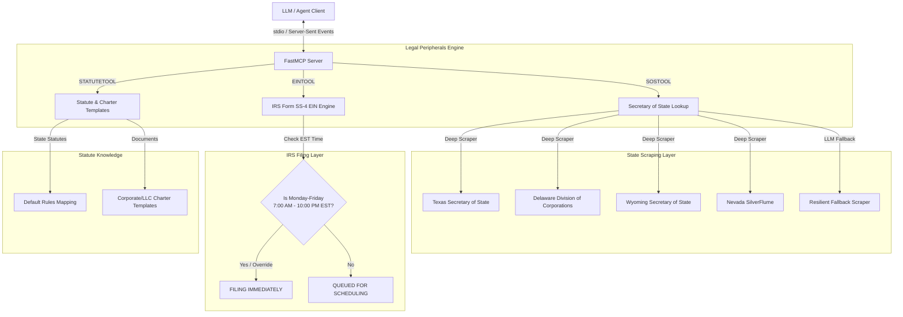

# ⚖️ Legal Peripherals MCP Server

<p align="center">
  
  
  
</p>

A premium Model Context Protocol (MCP) server powered by **FastMCP** that exposes highly robust tools for automating legal operations and filing compliance. This server handles state-level Secretary of State (SOS) entities, off-hours compliant IRS Form SS-4 EIN drafting/scheduling, and corporate/LLC charter templates lookup.

> **Documentation** — Installation, deployment, usage across the API and MCP
> interfaces, and the optional agent server are maintained in the
> [official documentation](https://knuckles-team.github.io/legal-peripherals-mcp/).

---

## 🗺️ System Architecture

The following diagram illustrates how the `Legal Peripherals MCP Server` coordinates between external LLM clients, state Secretary of State (SOS) databases, the IRS Form SS-4 preparation engine, and local template resources:



---

## 🛠️ MCP Tools Mapping

The server registers the following standard FastMCP tools, which can be dynamically enabled or disabled via environment toggles:

Auto-generated — do not edit between the markers below.

<!-- MCP-TOOLS-TABLE:START -->

#### Condensed action-routed tools (default — `MCP_TOOL_MODE=condensed`)

| MCP Tool | Toggle Env Var | Description |
|----------|----------------|-------------|
| `draft_ein_form` | `EINTOOL` | Draft IRS Form SS-4 and schedule EIN filing with off-hours compliance (Mon-Fri 7:00 AM - 10:00 PM EST). |
| `lookup_statute_rules` | `STATUTETOOL` | Query state statutory default rules and retrieve corporate/LLC charter templates. |
| `sos_entity_lookup` | `SOSTOOL` | Perform Secretary of State entity lookup across 50 states (scrapers for TX, DE, WY, NV, resilient fallback for others). |

#### Verbose 1:1 API-mapped tools (`MCP_TOOL_MODE=verbose` or `both`)

<details>
<summary>1 per-operation tools — one per public API method (click to expand)</summary>

| MCP Tool | Toggle Env Var | Description |
|----------|----------------|-------------|
| `legal_peripherals_request` | `APITOOL` | Invoke the request operation. |

</details>

_3 action-routed tool(s) (default) · 1 verbose 1:1 tool(s). Each is enabled unless its `<DOMAIN>TOOL` toggle is set false; `MCP_TOOL_MODE` selects the surface (`condensed` default · `verbose` 1:1 · `both`). Auto-generated — do not edit._
<!-- MCP-TOOLS-TABLE:END -->

---

### MCP Configuration Examples

> **Install the slim `[mcp]` extra.** All examples below install
> `legal-peripherals-mcp[mcp]` — the MCP-server extra that pulls only the FastMCP /
> FastAPI tooling (`agent-utilities[mcp]`). It deliberately **excludes** the heavy
> agent runtime (the epistemic-graph engine, `pydantic-ai`, `dspy`, `llama-index`,
> `tree-sitter`), so `uvx`/container installs are dramatically smaller and faster.
> Use the full `[agent]` extra only when you need the integrated Pydantic AI agent
> (see [Deployment & Installation](#-deployment--installation)).

Configure your IDE's `mcp.json` to launch the MCP server via `uvx`:

```json
{
  "mcpServers": {
    "legal-peripherals-mcp": {
      "command": "uvx",
      "args": [
        "--from",
        "legal-peripherals-mcp[mcp]",
        "legal-peripherals-mcp"
      ],
      "env": {
        "LEGAL_PERIPHERALS_BASE_URL": "http://localhost:8000",
        "LEGAL_PERIPHERALS_TOKEN": "your_token_here"
      }
    }
  }
}
```

---

## ⚙️ Environment Variables

Configure the server runtime using a `.env` file or direct container environment injections:

| Environment Variable | Type | Default | Description |
| :--- | :--- | :--- | :--- |
| **`SOSTOOL`** | `bool` | `True` | Toggle the `sos_entity_lookup` tool. |
| **`EINTOOL`** | `bool` | `True` | Toggle the `draft_ein_form` tool. |
| **`STATUTETOOL`** | `bool` | `True` | Toggle the `lookup_statute_rules` tool. |
| **`BYPASS_IRS_FILING_HOURS`** | `bool` | `False` | Bypasses the active-hours restriction during development/testing, enabling immediate submission mockups at any hour. |
| **`LEGAL_PERIPHERALS_BASE_URL`** | `str` | `http://localhost:8000` | The base URL of the backing legal peripherals web platform API. |
| **`LEGAL_PERIPHERALS_TOKEN`** | `str` | `""` | The authentication token / bearer credential for the backing API. |
| **`LEGAL_PERIPHERALS_SSL_VERIFY`** | `bool` | `True` | Toggles whether SSL verification is enforced on backing requests. |

---

## 🚀 Deployment & Installation

Pick the extra that matches what you want to run:

| Extra | Installs | Use when |
|-------|----------|----------|
| `legal-peripherals-mcp[mcp]` | Slim MCP server only (`agent-utilities[mcp]` — FastMCP/FastAPI) | You only run the **MCP server** (smallest install / image) |
| `legal-peripherals-mcp[agent]` | Full agent runtime (`agent-utilities[agent,logfire]` — Pydantic AI + the epistemic-graph engine) | You run the **integrated agent** |
| `legal-peripherals-mcp[all]` | Everything (`mcp` + `agent` + `logfire`) | Development / both surfaces |

```bash
# MCP server only (recommended for tool hosting — slim deps)
uv pip install "legal-peripherals-mcp[mcp]"

# Full agent runtime (Pydantic AI + epistemic-graph engine)
uv pip install "legal-peripherals-mcp[agent]"

# Everything (development)
uv pip install "legal-peripherals-mcp[all]"      # or: python -m pip install "legal-peripherals-mcp[all]"
```

### Option 1: Bare-Metal Setup (pip)

1. **Configure your Environment**:
   Create a `.env` file from the template:
   ```bash
   cp .env.example .env
   ```

2. **Start the Server**:
   ```bash
   python -m legal_peripherals_mcp.mcp_server
   ```

---

### Option 2: Containerized Setup (Docker)

One multi-stage `docker/Dockerfile` builds two right-sized images, selected by `--target`:

| Image tag | Build target | Contents | Entrypoint |
|-----------|--------------|----------|------------|
| `knucklessg1/legal-peripherals-mcp:mcp` | `--target mcp` | `legal-peripherals-mcp[mcp]` — **slim**, no engine/`pydantic-ai`/`dspy`/`llama-index`/`tree-sitter` | `legal-peripherals-mcp` |
| `knucklessg1/legal-peripherals-mcp:latest` | `--target agent` (default) | `legal-peripherals-mcp[agent]` — **full** agent runtime + epistemic-graph engine | `legal-peripherals-agent` |

1. **Build the Docker Image**:
   ```bash
   docker build --target mcp   -t knucklessg1/legal-peripherals-mcp:mcp    docker/   # slim MCP server
   docker build --target agent -t knucklessg1/legal-peripherals-mcp:latest docker/   # full agent
   ```

2. **Run the Container**:
   Pass your configuration variables as environment flags:
   ```bash
   docker run -d \
     --name legal-peripherals-mcp-service \
     -e SOSTOOL=True \
     -e EINTOOL=True \
     -e STATUTETOOL=True \
     -e BYPASS_IRS_FILING_HOURS=True \
     knucklessg1/legal-peripherals-mcp:mcp
   ```

> The `:mcp` tag is the **slim MCP-server image**; the default `:latest` tag is the
> **full agent image** (`legal-peripherals-mcp[agent]`) which also bundles the Pydantic
> AI agent and the epistemic-graph engine — use it when you run the agent, not just the
> MCP server.

### Knowledge-graph database (`epistemic-graph`)

The **full agent** (`[agent]` / `:latest`) embeds the **epistemic-graph** engine (pulled in
transitively via `agent-utilities[agent]`). For production — or to share one knowledge graph
across multiple agents — run **epistemic-graph as its own database container** and point the
agent at it instead of embedding it. Deployment recipes (single-node + Raft HA), connection
config, and the full database architecture (with diagrams) are documented in the
[epistemic-graph deployment guide](https://knuckles-team.github.io/epistemic-graph/deployment/).
The slim `[mcp]` server does **not** require the database.

---

## 🧪 Running the Test Suite

We maintain 100% logic coverage using `pytest` to verify off-hours filing computations, bypass states, Secretary of State scrapers, and charter mappings:

```bash
# Run tests with detailed verbose output
pytest -v
```

---

## Documentation

The complete documentation is published as the
[official documentation site](https://knuckles-team.github.io/legal-peripherals-mcp/)
and is the recommended reference for installation, deployment, and day-to-day
operation.

| Page | Contents |
|---|---|
| [Installation](https://knuckles-team.github.io/legal-peripherals-mcp/installation/) | pip, source, extras, prebuilt Docker image |
| [Deployment](https://knuckles-team.github.io/legal-peripherals-mcp/deployment/) | run the MCP server, the agent server, Compose, Caddy + Technitium, env config |
| [Usage](https://knuckles-team.github.io/legal-peripherals-mcp/usage/) | the MCP tools, the `Api` client, example prompts |
| [Overview](https://knuckles-team.github.io/legal-peripherals-mcp/overview/) | the three core domains and how they fit together |
| [Concepts](https://knuckles-team.github.io/legal-peripherals-mcp/concepts/) | concept registry (`CONCEPT:LEGAL-*`) |

`AGENTS.md` is the canonical contributor/agent guidance.

<!-- BEGIN GENERATED: additional-deployment-options -->
### Additional Deployment Options

`legal-peripherals-mcp` can also run as a **local container** (Docker / Podman / `uv`) or be
consumed from a **remote deployment**. The
[Deployment guide](https://knuckles-team.github.io/legal-peripherals-mcp/deployment/) has full, copy-paste
`mcp_config.json` for all four transports — **stdio**, **streamable-http**,
**local container / uv**, and **remote URL**:

- **Local container / uv** — launch the server from `mcp_config.json` via `uvx`,
  `docker run`, or `podman run`, or point at a local streamable-http container by `url`.
- **Remote URL** — connect to a server deployed behind Caddy at
  `http://legal-peripherals-mcp.arpa/mcp` using the `"url"` key.
<!-- END GENERATED: additional-deployment-options -->


<!-- BEGIN agent-os-genesis-deploy (generated; do not edit between markers) -->

## Deploy with `agent-os-genesis`

This package can be provisioned for you — skill-guided — by the **`agent-os-genesis`**
universal skill (its *single-package deploy mode*): it picks your install method, seeds
secrets to OpenBao/Vault (or `.env`), trusts your enterprise CA, registers the MCP
server, and verifies it — the same machinery that stands up the whole Agent OS, narrowed
to just this package. Ask your agent to **"deploy `legal-peripherals-mcp` with agent-os-genesis"**.

| Install mode | Command |
|------|---------|
| Bare-metal, prod (PyPI) | `uvx legal-peripherals-mcp` · or `uv tool install legal-peripherals-mcp` |
| Bare-metal, dev (editable) | `uv pip install -e ".[all]"` · or `pip install -e ".[all]"` |
| Container, prod | deploy `knucklessg1/legal-peripherals-mcp:latest` via docker-compose / swarm / podman / podman-compose / kubernetes |
| Container, dev (editable) | deploy `docker/compose.dev.yml` (source-mounted at `/src`; edits live on restart) |

Secrets are read-existing + seeded via `vault_sync` — you are only prompted for what's missing.

<!-- END agent-os-genesis-deploy -->

## Environment Variables

<!-- ENV-VARS-TABLE:START -->

#### Package environment variables

| Variable | Example | Description |
|----------|---------|-------------|
| `SOSTOOL` | `True` | Tool Suite Toggles |
| `EINTOOL` | `True` |  |
| `STATUTETOOL` | `True` |  |
| `BYPASS_IRS_FILING_HOURS` | `False` | IRS EIN API hours simulation override (optional, True to bypass hours restriction in dev) |
| `EIN_TIMEOUT_SECONDS` | `30` | EIN draft request timeout in seconds |
| `SOS_TIMEOUT_SECONDS` | `30` | Secretary of State entity lookup (OpenCorporates company registry) |
| `OPENCORPORATES_API_TOKEN` | — |  |
| `OPENCORPORATES_BASE_URL` | `https://api.opencorporates.com/v0.4` |  |
| `STATUTE_TIMEOUT_SECONDS` | `30` | Statute / charter lookup request timeout in seconds |
| `LEGAL_PERIPHERALS_BASE_URL` | `http://localhost:8000` | API Client Connection Configuration |
| `LEGAL_PERIPHERALS_TOKEN` | — |  |
| `LEGAL_PERIPHERALS_SSL_VERIFY` | `True` |  |

#### Inherited agent-utilities variables (apply to every connector)

| Variable | Example | Description |
|----------|---------|-------------|
| `TRANSPORT` | `stdio` | MCP transport: `stdio` | `streamable-http` | `sse` |
| `HOST` | `0.0.0.0` | Bind host (HTTP transports) |
| `PORT` | `8000` | Bind port (HTTP transports) |
| `MCP_TOOL_MODE` | `condensed` | Tool surface: `condensed` | `verbose` | `both` |
| `MCP_ENABLED_TOOLS` | — | Comma-separated tool allow-list |
| `MCP_DISABLED_TOOLS` | — | Comma-separated tool deny-list |
| `MCP_ENABLED_TAGS` | — | Comma-separated tag allow-list |
| `MCP_DISABLED_TAGS` | — | Comma-separated tag deny-list |
| `EUNOMIA_TYPE` | `none` | Authorization mode: `none` | `embedded` | `remote` |
| `EUNOMIA_POLICY_FILE` | `mcp_policies.json` | Embedded Eunomia policy file |
| `EUNOMIA_REMOTE_URL` | — | Remote Eunomia authorization server URL |
| `ENABLE_OTEL` | `False` | Enable OpenTelemetry export |
| `OTEL_EXPORTER_OTLP_ENDPOINT` | — | OTLP collector endpoint |
| `MCP_CLIENT_AUTH` | — | Outbound MCP auth (`oidc-client-credentials` for fleet calls) |
| `OIDC_CLIENT_ID` | — | OIDC client id (service-account auth) |
| `OIDC_CLIENT_SECRET` | — | OIDC client secret (service-account auth) |
| `DEBUG` | `False` | Verbose logging |
| `PYTHONUNBUFFERED` | `1` | Unbuffered stdout (recommended in containers) |
| `MCP_URL` | `http://localhost:8000/mcp` | URL of the MCP server the agent connects to |
| `PROVIDER` | `openai` | LLM provider for the agent |
| `MODEL_ID` | `gpt-4o` | Model id for the agent |
| `ENABLE_WEB_UI` | `True` | Serve the AG-UI web interface |

_12 package + 22 inherited variable(s). Auto-generated from `.env.example` + the shared agent-utilities set — do not edit._
<!-- ENV-VARS-TABLE:END -->
